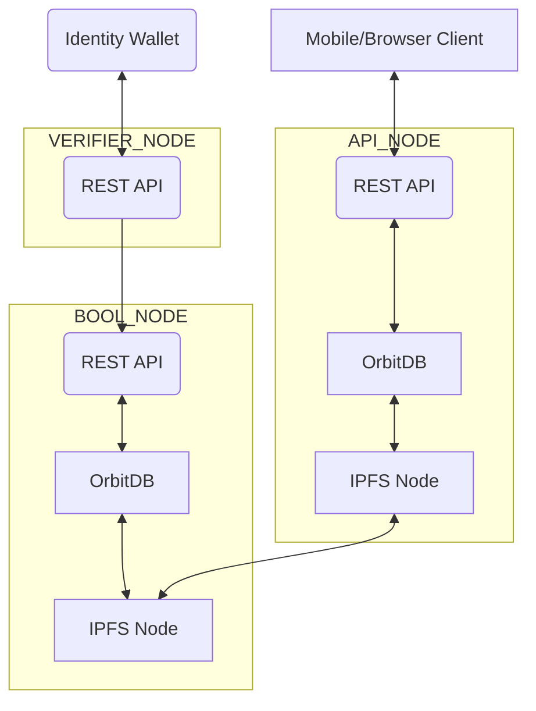

# boolcheck backend

本リポジトリにはboolcheckを構成するwebアプリケーションが3つ含まれています。



## BOOL_NODE
Boolcheckでは真偽情報を[分散データベース(OrbitDB)](https://github.com/orbitdb/orbitdb)に書き込みます。
アーキテクチャや機能については[こちら](./docs/architecture.md)を参照ください。

BOOL_NODEは真偽情報の更新用ノードであり、更新系の[API](./docs/open-api/node.yaml)を公開します。
更新系APIへのアクセスは一部を除きVERIFIER_NODEからのアクセスのみを許容します。

また、真偽情報のデータ構造については[こちら](./docs/er.md)を参照してください。

## API_NODE
API_NODEは起動するとBOOL_NODEに接続してデータを同期します。

API_NODEは真偽情報の参照用ノードであり、参照系の[API](./docs/open-api/api.yaml)を公開します。

## VERIFIER_NODE
VERIFIER_NODEはOID4VPのVerifier機能を提供し、主にアイデンティティウォレットと連携して真偽情報を受け取ります。

# インストール

## 必要条件

Node.js バージョン 20 以上がインストールされていることを確認してください。必要に応じて、nvm（Node Version Manager）を使用して適切な Node.js のバージョンをインストールし、使用できます。

```shell
nvm install stable --latest-npm
nvm use 20
yarn
```

# ビルド
## BOOL_NODE

```shell
yarn run build:bool_node
```

.env.template を元に .env ファイルを作成してください。必要に応じて内容を調整してください。

```shell
cp .env.template.bool_node ./apps/bool_node/.env
```

| 環境変数名              | 内容                           | 値                     |
|------------------------|------------------------------|----------------------|
| APP_TYPE              | アプリの種類                 | BOOL_NODE            |
| APP_PORT              | アプリのポート番号           | 3000                 |
| NODE_ENV              | 環境                         | local                |
| **OrbitDB 設定**       |                              |                      |
| PEER_ADDR            | ピアのアドレス               | /ip4/0.0.0.0/tcp/4000 |
| ORBITDB_ROOT_ID_KEY  | OrbitDB のルート ID キー     | main_peer            |
| IPFS_PATH            | IPFS のデータ保存先          | ./ipfs/blocks        |
| ORBITDB_PATH         | OrbitDB のデータ保存先       | ./orbitdb            |
| KEYSTORE_PATH        | キーストアの保存先           | ./keystore           |
| **その他**            |                              |                      |
| DATABASE_FILEPATH    | データベースファイルのパス   | ./database.sqlite    |

---

## API_NODE

```shell
yarn run build:api_node
```

.env.template を元に .env ファイルを作成してください。必要に応じて内容を調整してください。

```shell
cp .env.template.api_node ./apps/api_node/.env
```

| 環境変数名              | 内容                           | 値                     |
|------------------------|------------------------------|----------------------|
| APP_TYPE              | アプリの種類                 | API_NODE             |
| APP_PORT              | アプリのポート番号           | 3001                 |
| NODE_ENV              | 環境                         | local                |
| **OrbitDB 設定**       |                              |                      |
| PEER_ADDR            | ピアのアドレス               | /ip4/0.0.0.0/tcp/4001 |
| ORBITDB_ROOT_ID_KEY  | OrbitDB のルート ID キー     | peer2                |
| IPFS_PATH            | IPFS のデータ保存先          | ./ipfs/blocks        |
| ORBITDB_PATH         | OrbitDB のデータ保存先       | ./orbitdb            |
| KEYSTORE_PATH        | キーストアの保存先           | ./keystore           |
| **その他**            |                              |                      |
| DATABASE_FILEPATH    | データベースファイルのパス   | ./database.sqlite    |

---

## VERIFIER_NODE

```shell
yarn run build:verifier_node
```

.env.template を元に .env ファイルを作成してください。必要に応じて内容を調整してください。

```shell
cp .env.template.verifier_node ./apps/verifier_node/.env
```

| 環境変数名                                      | 内容                                         | 値                                      |
|------------------------------------------------|--------------------------------------------|----------------------------------------|
| APP_TYPE                                      | アプリの種類                              | VERIFIER_NODE                         |
| APP_PORT                                      | アプリのポート番号                        | 3002                                  |
| **OrbitDB 設定**                               |                                            |                                        |
| ORBITDB_ROOT_ID_KEY                           | OrbitDB のルート ID キー                  | peer_vp                               |
| OID4VP_ORBITDB_ROOT_ID_KEY                    | OID4VP 用 OrbitDB のルート ID キー         | oid4vp                                |
| OID4VP_IPFS_PATH                              | OID4VP 用 IPFS のデータ保存先              | ./oid4vp/ipfs/blocks                  |
| OID4VP_ORBITDB_PATH                           | OID4VP 用 OrbitDB のデータ保存先           | ./oid4vp/orbitdb                      |
| OID4VP_KEYSTORE_PATH                          | OID4VP 用キーストアの保存先                | ./oid4vp/keystore                     |
| **OID4VP 設定**                               |                                            |                                        |
| OID4VP_CLIENT_ID_SCHEME                       | クライアント ID スキーム                   | x509_san_dns                          |
| OID4VP_VERIFIER_JWK                           | 検証者の JWK（JSON Web Key）               | {"kty":"EC","crv":"P-256","x":"","d":""} |
| OID4VP_VERIFIER_X5C                           | 検証者の X.509 証明書（PEM 形式）          | PEM形式のサーバー証明書                |
| OID4VP_REQUEST_HOST                           | OID4VP のリクエストホスト                  | oid4vp://localhost/request            |
| OID4VP_REQUEST_EXPIRED_IN_AT_RESPONSE_ENDPOINT| レスポンスエンドポイントでのリクエスト有効期限 | 600                                    |
| OID4VP_REQUEST_EXPIRED_IN_AT_VERIFIER         | 検証者でのリクエスト有効期限                | 600                                    |
| OID4VP_RESPONSE_EXPIRED_IN                    | OID4VP のレスポンス有効期限                | 600                                    |
| OID4VP_CLIENT_ID                              | クライアント ID                             | http://localhost                      |
| OID4VP_CLIENT_METADATA_NAME                   | クライアントの名前                         | boolcheck.com                         |
| OID4VP_CLIENT_METADATA_LOGO_URI               | クライアントのロゴ URI                     | http://localhost/logo.png             |
| OID4VP_CLIENT_METADATA_POLICY_URI             | クライアントのポリシー URI                 | http://localhost/policy.html          |
| OID4VP_CLIENT_METADATA_TOS_URI                | クライアントの利用規約 URI                 | http://localhost/tos.html             |
| OID4VP_PRESENTATION_DEFINITION_URI            | プレゼンテーション定義の URI               | http://localhost/oid4vpi/presentation-definitions |
| OID4VP_REQUEST_URI                            | OID4VP のリクエスト URI                    | http://localhost/oid4vpi/request      |
| OID4VP_RESPONSE_URI                           | OID4VP のレスポンス URI                    | http://localhost/oid4vpi/responses    |
| OID4VP_REDIRECT_URI                           | OID4VP のリダイレクト URI                  | http://localhost/oid4vpi/redirect     |
| **その他**                                    |                                            |                                        |
| POST_SESSION_EXPIRED_IN                       | セッションの有効期限（秒）                 | 600                                    |
| POST_STATE_EXPIRED_IN                         | 状態の有効期限（秒）                       | 600                                    |
| COOKIE_SECRET                                 | クッキーの暗号化キー                        | some secret hurr                      |

# 実行
## BOOL_NODE
```shell
nvm use 20
yarn run start:bool_node
```

## API_NODE
```shell
nvm use 20
yarn run start:api_node
```

## VERIFIER_NODE
```shell
nvm use 20
yarn run start:verifier_node
```
