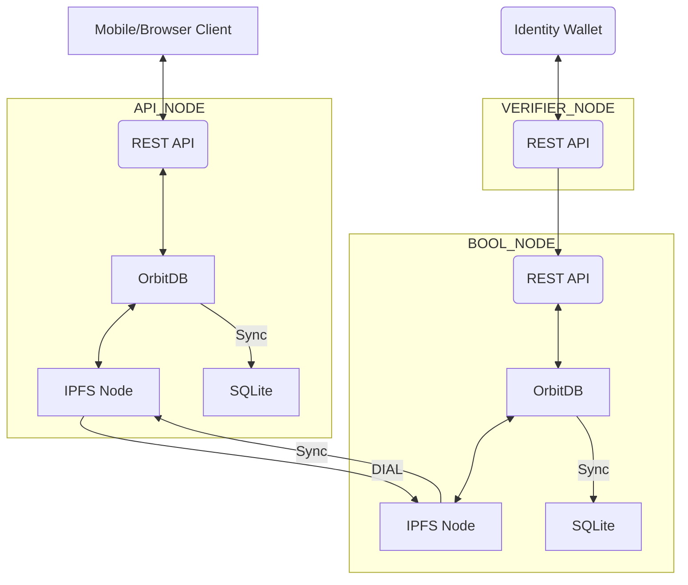
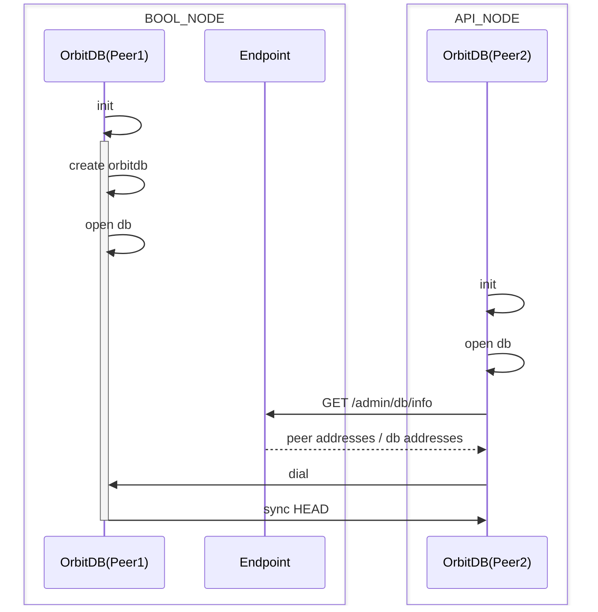

## 全体構成



### データ同期を伴う初期化シーケンス


### 関連API
以下はOrbitDBをレプリケーションする際に必要となるAPIです。API_NODEは自動的にレプリケーションを開始するため通常はこれらのAPIを呼び出す必要はありません。

| No | endpoint | method | 対象ピア | description                    |
| --- | --- | --- | --- |--------------------------------|
| 1 | /admin/peer/info | get | レプリカ | レプリカ側が権限の付与先として自身の情報を取得する       |
| 2 | /admin/access-right/grant | post | マスター | レプリカからマスターへ権限付与をリクエストする |
| 3 | /admin/db/info | get | マスター | 同期先のDBのアドレスを取得する               |
| 4 | /admin/db/sync | post | レプリカ | DB同期を開始する                       |

#### 1. ピア情報を取得するAPI
ピアの情報を取得します。通常権限付与に必要な情報を取得するために使用します。

リクエスト例
```shell
curl GET http://localhost:3001/admin/peer/info
```

レスポンス例
```json
{
  "identity": {
    "hash": "zdpuApFsGKjyj8gce9LkFDdVzqkySgxmtE4RqjvbzmqAiGbCa"
  },
  "multiaddrs": [
    "/ip4/127.0.0.1/tcp/4004/p2p/12D3KooWGQdrhLxznLCp4T3gy8X7YGxYUMn2mA6zBtshJcwWv8LP",
    "/ip4/192.168.10.105/tcp/4004/p2p/12D3KooWGQdrhLxznLCp4T3gy8X7YGxYUMn2mA6zBtshJcwWv8LP",
    "/ip4/192.168.64.1/tcp/4004/p2p/12D3KooWGQdrhLxznLCp4T3gy8X7YGxYUMn2mA6zBtshJcwWv8LP"
  ]
}
```

#### 2. 書き込み権限を付与するAPI
書き込み権限を付与する場合、付与したいピアの情報を指定して本APIを呼び出します。

リクエスト例
```shell
curl -X POST "http://localhost:3000/admin/access-right/grant" \
     -H "Content-Type: application/json" \
     -d '{
          "identity": {
            "hash": "zdpuAmJy4oRXnPdj9meJMM1t79zGW1F7V6UiC5t7sTRK5ktRe"
          },
          "multiaddrs": [
            "/ip4/127.0.0.1/tcp/4001/p2p/12D3KooWDNA6V8dEWQ1iJyjSAMHtqXdLa9VxbVb31P5EjoCZVqqB",
            "/ip4/192.168.0.32/tcp/4001/p2p/12D3KooWDNA6V8dEWQ1iJyjSAMHtqXdLa9VxbVb31P5EjoCZVqqB",
            "/ip4/192.168.64.1/tcp/4001/p2p/12D3KooWDNA6V8dEWQ1iJyjSAMHtqXdLa9VxbVb31P5EjoCZVqqB"
          ]
        }'
```

#### 3. DB情報を取得するAPI
通常、レプリケーションを開始する場合に同期対象のDB情報を取得するために使用します。

リクエスト例
```shell
curl http://localhost:3000/admin/db/info
```

レスポンス例
```json
{
  "documents": {
    "urls": {
      "address": "/orbitdb/zdpuAo6Bidhze4zt4rs6eq1iWvH2reZFKfwBgPRmFzB7HT4SD",
      "indexBy": "id"
    },
    "claimers": {
      "address": "/orbitdb/zdpuAnvr8DPwfDkf3MKfAHnfXS4dRsyAfmXxuDF5uAA99vg7s",
      "indexBy": "id"
    },
    "claims": {
      "address": "/orbitdb/zdpuB2ScVBzdk6KLqjN76UTwUkmBpp8f12B744yieAbaVuY5o",
      "indexBy": "id"
    },
    "affiliations": {
      "address": "/orbitdb/zdpuAkoQ6jnUzFrdcET5jZZ5T4VRj2zs4haiirQGCL69p5KLa",
      "indexBy": "id"
    }
  },
  "peer": {
    "multiaddrs": [
      "/ip4/127.0.0.1/tcp/4000/p2p/12D3KooWSbK7XJy7b9NEJnP5v4kXfSfEe2cXa8mv92wZGKJudFWh",
      "/ip4/192.168.10.106/tcp/4000/p2p/12D3KooWSbK7XJy7b9NEJnP5v4kXfSfEe2cXa8mv92wZGKJudFWh",
      "/ip4/192.168.64.1/tcp/4000/p2p/12D3KooWSbK7XJy7b9NEJnP5v4kXfSfEe2cXa8mv92wZGKJudFWh"
    ]
  }
}

```

#### 4. レプリケーションを開始するAPI
同期対象のDB情報を指定してレプリケーションを開始します。

リクエスト例
```shell
curl -X POST "http://localhost:3001/admin/db/sync" \
     -H "Content-Type: application/json" \
     -d '{
          "documents": {
            "urls": {
              "address": "/orbitdb/zdpuB2PP3LmNpyPT1ZTBUeh4uidHhgv3VhubykDKZSLGofBPJ",
              "indexBy": "id"
            },
            "claimers": {
              "address": "/orbitdb/zdpuAoj8sDxM8LfAu4K9ufoWKMEiVrbLTvS9om1bY1u9zP8ao",
              "indexBy": "id"
            },
            "claims": {
              "address": "/orbitdb/zdpuAx2asDX2gsURW3qTrJLGpWM1xas1kaHXnJ7HiTa1C6MDL",
              "indexBy": "id"
            },
            "affiliates": {
              "address": "/orbitdb/zdpuAxw1Jc2NsJcJ61p54M27nBCfgCMFnvyvEPfBPrpZtzjoy",
              "indexBy": "id"
            }
          },
          "peer": {
            "multiaddrs": [
              "/ip4/127.0.0.1/tcp/4000/p2p/12D3KooWAoC8wrTvYfe1oUXx7hnGQ2XwA5BKkWFswPxsaFPxSeb4",
              "/ip4/192.168.0.32/tcp/4000/p2p/12D3KooWAoC8wrTvYfe1oUXx7hnGQ2XwA5BKkWFswPxsaFPxSeb4",
              "/ip4/192.168.64.1/tcp/4000/p2p/12D3KooWAoC8wrTvYfe1oUXx7hnGQ2XwA5BKkWFswPxsaFPxSeb4"
            ]
          }
        }'
```
