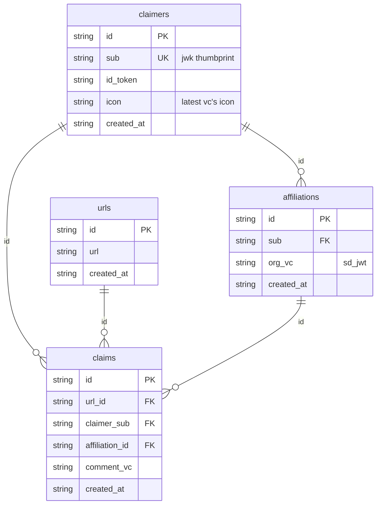

## エンティティ一覧

### claimers
投稿者を表すドキュメント

| Column       | Type    | Constraints          | Description                           |
|-------------|--------|----------------------|--------------------------------------|
| id          | string | PK (uuidv4)          | 投稿者の一意な識別子               |
| sub         | string | UK (jwk thumbprint)  | JWKのサムプリント（公開鍵の一意な識別子） |
| id_token    | string |                      | IDトークン（JWT）                      |
| icon        | string |                      | 最新のVCのアイコン                     |
| created_at  | string |                      | レコードの作成日時                      |

### urls
真偽コメントの対象URLを表すドキュメント

| Column       | Type    | Constraints | Description                         |
|-------------|--------|-------------|------------------------------------|
| id          | string | PK (uuidv4) | URLの一意な識別子                    |
| url         | string |             | クレーム対象のURL                     |
| domain      | string |             | URLのドメイン名                       |
| title       | string |             | Webページのタイトル                   |
| content_type| string |             | コンテンツの種類（例: text/html）        |
| description | string |             | ページの説明                          |
| image       | string |             | ページのサムネイル画像URL               |
| created_at  | string |             | レコードの作成日時                     |

### claims
真偽コメントを表すドキュメント

| Column        | Type    | Constraints | Description                         |
|--------------|--------|-------------|------------------------------------|
| id           | string | PK          | クレームの一意な識別子                |
| url_id       | string | FK          | クレーム対象のURL ID                 |
| claimer_id   | string | FK          | クレームを行った投稿者のID         |
| affiliation_id | string | FK        | 投稿者の所属ID（任意）             |
| comment      | string |             | クレーム内容（JWT形式）                |
| created_at   | string |             | レコードの作成日時                     |

### affiliations
所属VCを表すドキュメント

| Column        | Type    | Constraints  | Description                         |
|--------------|--------|--------------|------------------------------------|
| id           | string | PK (uuidv4)  | 所属の一意な識別子                   |
| claimer_id   | string | FK           | 投稿者のID                       |
| claimer_sub  | string | FK           | 投稿者のJWKサムプリント             |
| organization | string |              | 所属組織（SD-JWTで表現）              |
| created_at   | string |              | レコードの作成日時                     |

## ER図

